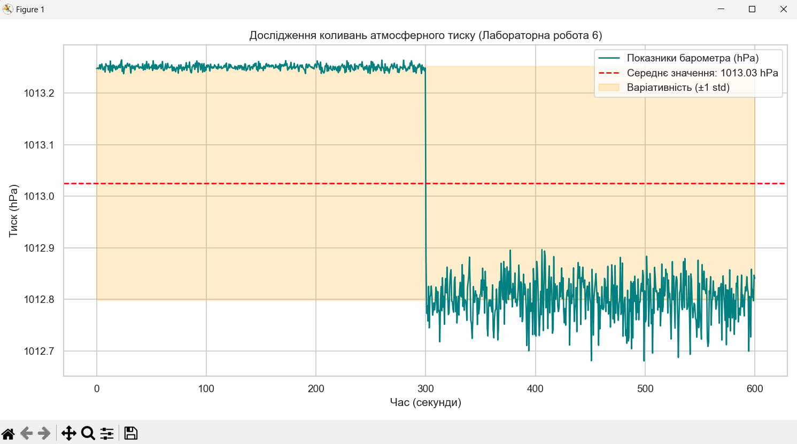

# Лабораторна робота 6

## Тема
Дослідження різниці атмосферного тиску всередині приміщення та на вулиці.

## Мета
- порівняти атмосферний тиск у приміщенні та на вулиці;
- визначити коливання тиску залежно від погодних умов і часу доби;
- обробити реальні дані, зібрані мобільним додатком, і провести аналітичну візуалізацію.

## Опис роботи
Для лабораторної роботи використовується реальний набір даних сенсора барометра, зібраний із мобільного телефону через додаток, який експортує дані у формат CSV. Аналіз виконується за допомогою Python-скрипту `Pr6.py`.

## Структура проекту
- `Pr6.py` — скрипт для обробки та аналізу даних атмосферного тиску;
- `sensor_data_example.csv` — приклад файлу з реальними даними, який містить два стовпці: `time` та `pressure`.

## Завдання
1. Завантажити дані з мобільного додатку (Phyphox, Science Journal або аналогічного).
2. Експорт у CSV з колонками `time` та `pressure`.
3. Виконати аналіз за допомогою `Pr6.py`.
4. Проаналізувати:
   - середнє значення тиску;
   - стандартне відхилення;
   - діапазон коливань;
   - залежність тиску від часу доби.

## Результати аналізу


## Як запускати
1. Переконайтеся, що встановлені залежності:
   - `pandas`
   - `numpy`
   - `matplotlib`
   - `seaborn`
   - `scipy`
2. Запустіть скрипт:

```bash
python Pr6.py
```

3. Для аналізу власного файлу змініть назву файлу в блоці `if __name__ == "__main__"` або передайте шлях до CSV прямо в функцію `analyze_pressure_data()`.

## Коментарі до методики
- Збирання даних виконано за допомогою мобільного сенсора барометра.
- Дані потрібно збирати як всередині приміщення, так і на вулиці, щоб порівнювати вплив умов.
- Аналіз стандартного відхилення дозволяє оцінити ступінь мікроколивань тиску.
- Візуалізація показує зміни тиску у часі та допомагає виділити періоди стабільності або нестабільності.

## Висновок
Ця робота дозволяє дослідити атмосферний тиск у різних умовах та встановити, наскільки стабільний тиск у приміщенні порівняно з тиском на вулиці. Результати важливі для розуміння впливу метеоумов і режиму вентиляції на поведінку повітряного тиску.